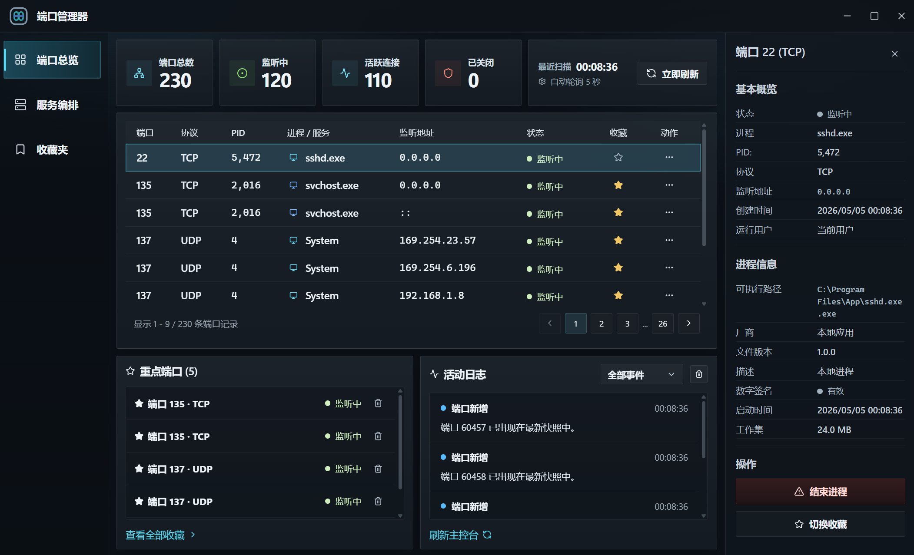

# Port Manager

Port Manager 是一个以 Windows 为优先目标的 Tauri 桌面端口管理工具，用来统一查看本机端口、关联进程、受管服务和重点收藏对象。



## 快速开始

### 环境前提

- Windows
- Node.js
- npm
- Rust stable
- Cargo 可用

### 安装依赖

```bash
npm install
```

### 启动浏览器预览

```bash
cd apps/desktop
npm run dev
```

### 启动桌面端

```bash
cd apps/desktop
npx @tauri-apps/cli dev
```

### 运行基础校验

```powershell
cargo check --workspace
```

## 功能特性

- 端口扫描：统一展示本机 TCP/UDP 端口、监听地址、进程和状态
- 进程详情：按 PID 拉取真实可执行路径、启动时间、内存占用、厂商、文件版本和数字签名状态；采集不到的字段直接留空，不做前端猜测
- 进程控制：支持按端口结束占用进程
- 服务编排：支持登记服务、启动服务、停止服务，并为命令型服务记录日志文件、根 PID、子进程列表和可选停止命令
- 项目识别：支持从 `package.json`、`docker-compose.yml|yaml`、`pom.xml` 检测候选服务，并回填到桌面端登记表单
- 收藏视图：支持收藏重点端口和服务，做快速操作入口
- 桌面控制台式 UI：以高信息密度暗色桌面界面为主，不是网页后台

## 技术栈

- Rust workspace
- Tauri 2
- React 18
- TypeScript
- Vite
- TanStack Query
- SQLite

## 项目结构

- `apps/desktop`
  - 桌面前端与 Tauri 壳层
- `apps/cli`
  - 命令行入口
- `crates/domain`
  - 领域对象与核心模型
- `crates/ports`
  - 端口抽象接口
- `crates/application`
  - 应用服务与 DTO
- `crates/adapters/*`
  - Windows、SQLite、命令执行等适配层
- `crates/interfaces/*`
  - CLI 与 Tauri 接口层
- `data`
  - 本地运行数据目录
